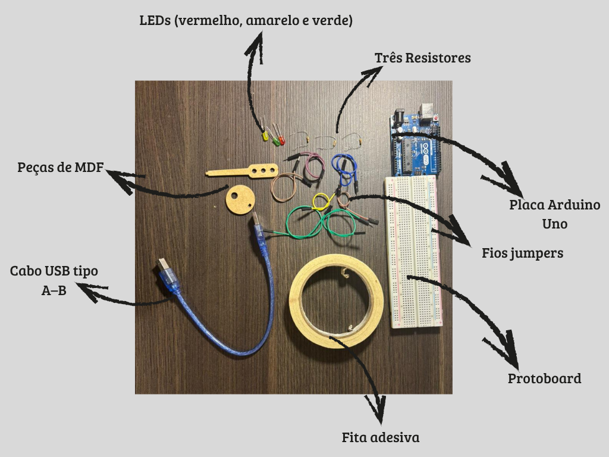
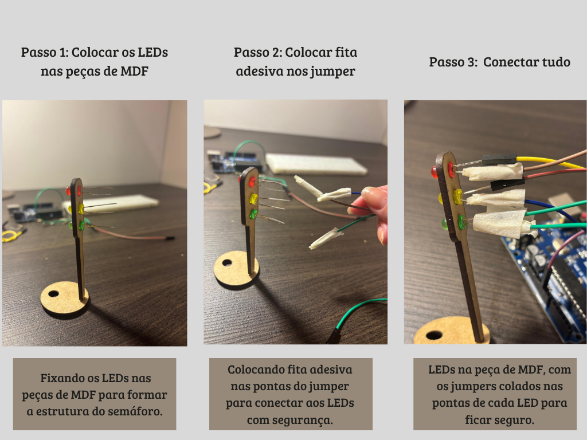
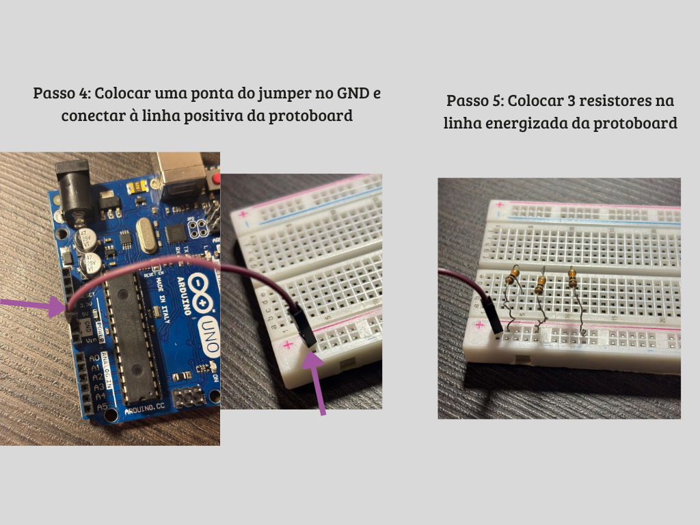
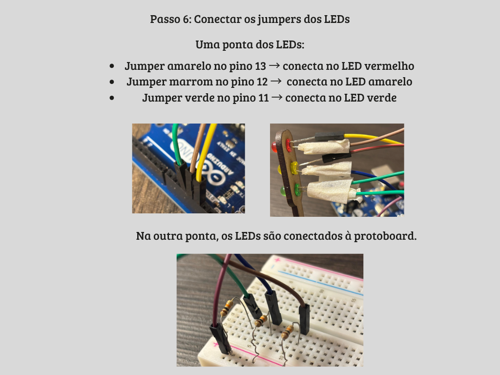
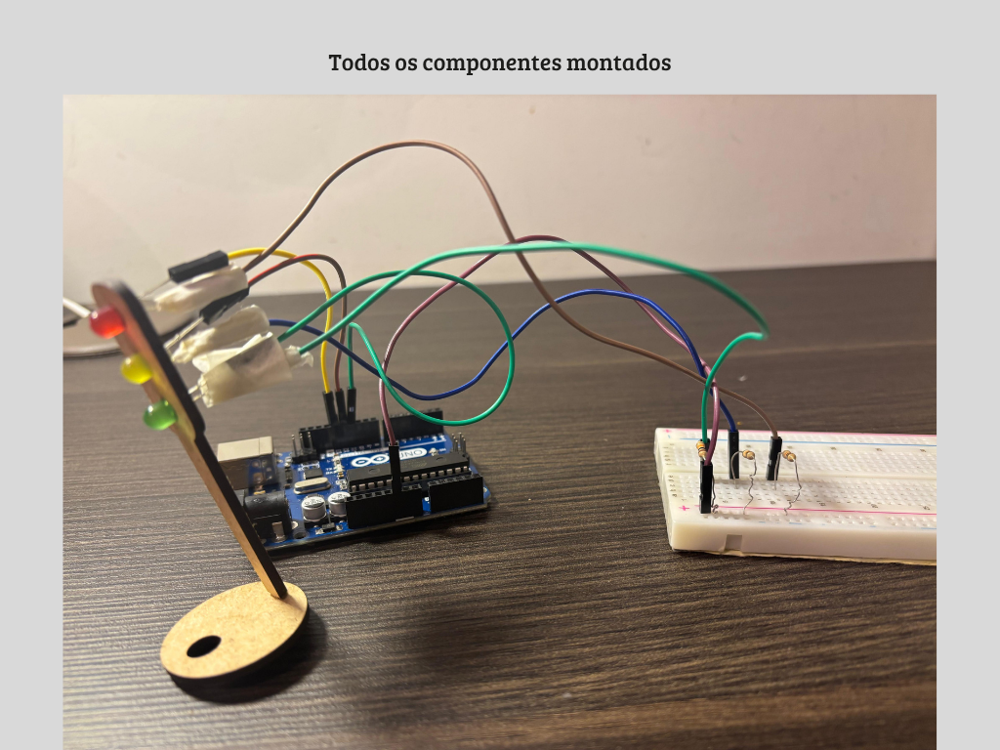
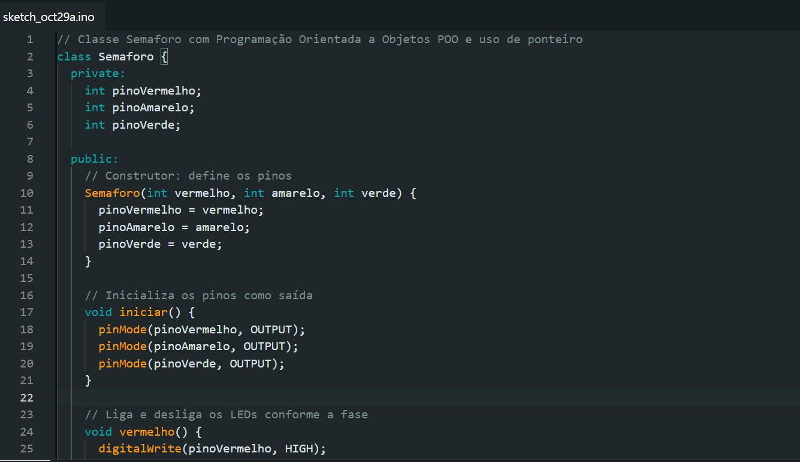
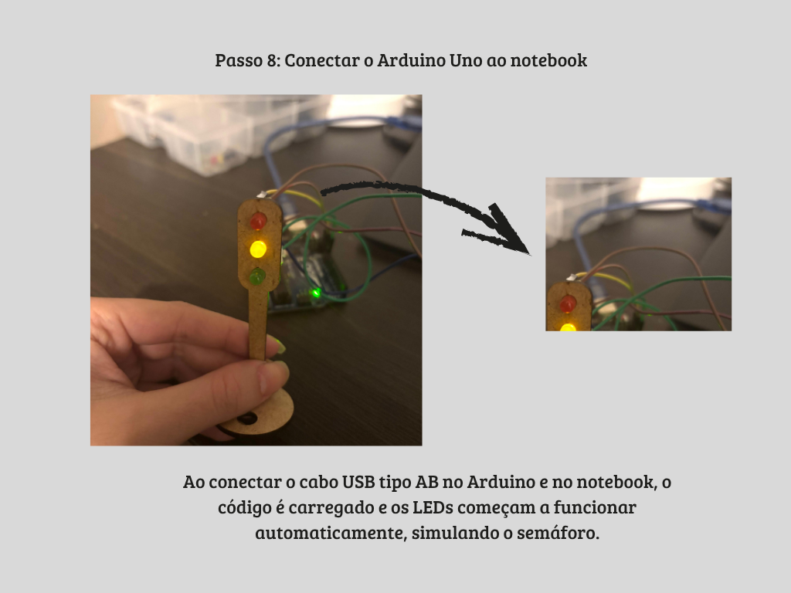

## Contexto do Projeto

O trânsito em grandes cidades costuma ser intenso, e cruzamentos movimentados exigem semáforos bem sincronizados para evitar acidentes e filas de veículos.  

Neste cenário o projeto busca crir uma **simulação prática de semáforo urbano**, utilizando LEDs e Arduino, seguindo tempos típicos de cada fase do sinal.  
A atividade demonstra como conceitos básicos de **eletrônica e programação** podem ser aplicados para criar soluções que ajudam a **organizar o fluxo de veículos e garantir a segurança dos pedestres**.

## Objetivo

Montar e programar um semáforo utilizando LEDs e resistores em uma protoboard, simulando o funcionamento real de um cruzamento urbano.  
O sistema deve alternar entre as luzes **vermelha, amarela e verde**, respeitando o tempo de cada fase, garantindo segurança e fluidez no trânsito.

---

## Materiais Utilizados

| Componente       | Quantidade | Descrição |
|------------------|-------------|--------------------|
| LED Vermelho     | 1           | Representa o sinal de **parar** |
| LED Amarelo      | 1           | Representa o **atenção** |
| LED Verde        | 1           | Representa o sinal de **seguir** |
| Resistores 220Ω  | 3           | Limitam a corrente para proteger os LEDs |
| Protoboard       | 1           | Montagem do circuito |
| Jumpers          | 7           | Conexões entre Arduino e protoboard |
| Arduino UNO      | 1           | Controla o tempo e sequência dos LEDs |
| Cabo USB         | 1           | Conexão com o computador para upload do código |

---

## Montagem Física

Abaixo está o passo a passo da montagem física do circuito do semáforo.  
As imagens estão disponíveis na pasta [`assets/`](./assets).

### Componentes

   
   

   

   

   

   

 
   

   

---

## Demonstração do Funcionamento

O funcionamento do semáforo foi testado e registrado em vídeo, mostrando a sequência correta das luzes e os tempos de cada fase:  

- 🔴 **Vermelho:** 6 segundos  
- 🟢 **Verde:** 4 segundos  
- 🟡 **Amarelo:** 2 segundos  
 
📎 [Link para o vídeo de demonstração](https://github.com/Karol-barbosa/Ponderada-Semaforo/blob/main/video.mp4)

---

## Conclusão

O projeto permitiu **simular um semáforo urbano funcional**, aplicando conceitos de eletrônica básica, programação e temporização.  
Foi possível observar na prática como o controle das luzes influencia o fluxo de veículos e pedestres, reforçando a importância da **organização e segurança no trânsito**.  
